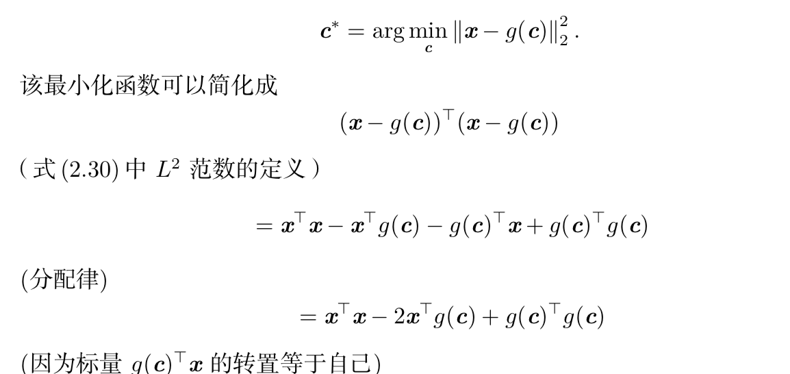

**主成分分析(principal components analysis, PCA)**

* 假设在 Rn 空间中我们有 m 个点 {x(1), . . . , x(m)}，我们希望对这些点进行有损 压缩。有损压缩表示我们使用更少的内存，但损失一些精度去存储这些点。我们希 望损失的精度尽可能少

* 目标函数:$$c^* = arg_c min = 2x^\tau g(c) + g(c)^\tau g(c)$$

  
