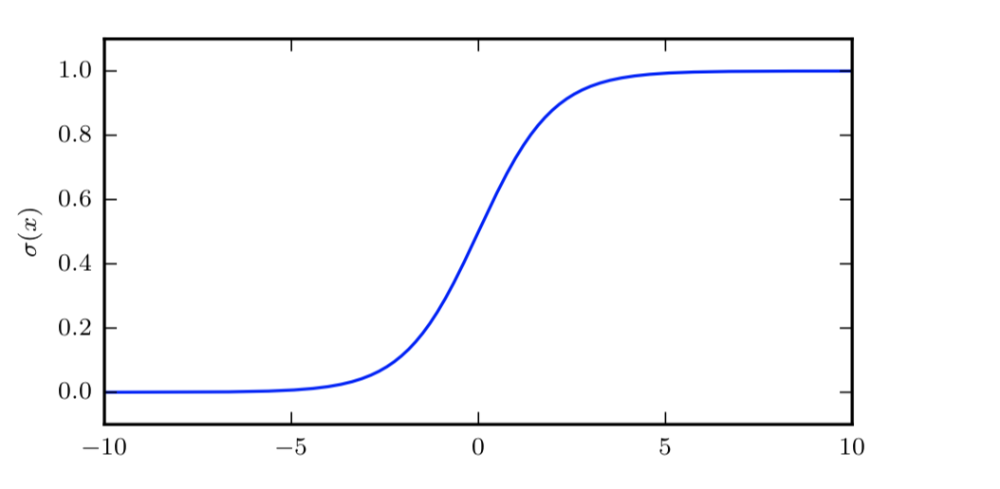
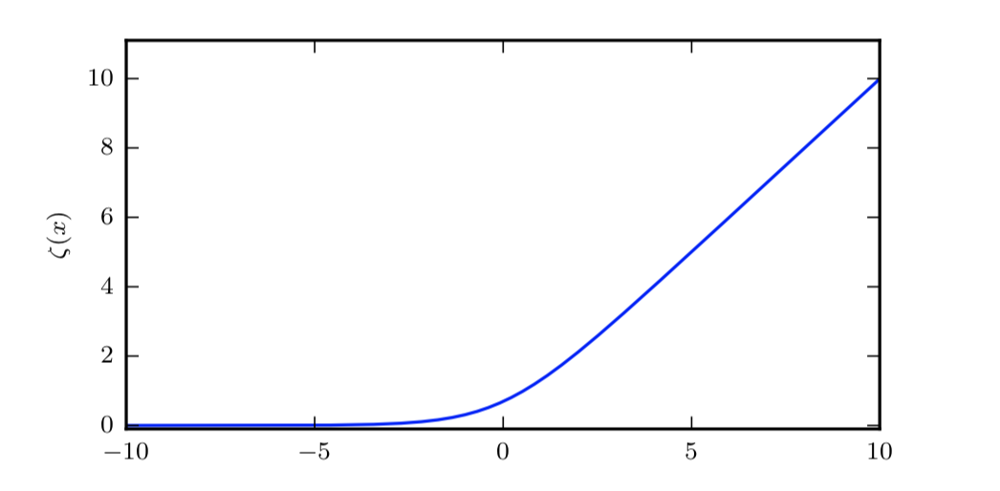
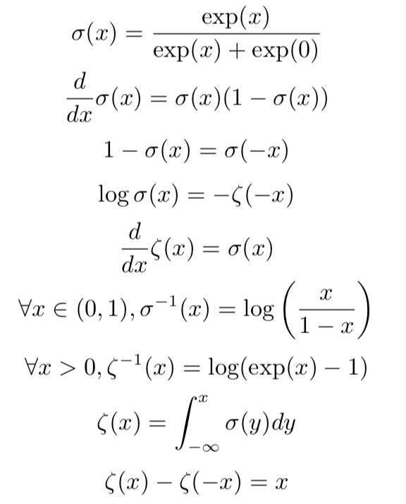

**logistic sigmoid函数**：

$$\sigma (x) = \frac {1}{1+exp(-x)}​$$

* logistic sigmoid 函数通常用来产生 Bernoulli 分布中的参数 φ，因为它的范围是 (0, 1)，处在 φ 的有效取值范围内

* sigmoid 函数 在变量取绝对值非常大的正值或负值时会出现 饱和(saturate)现象，意味着函数会 变得很平，并且对输入的微小改变会变得不敏感

  

**softplus 函数(softplus function)**:

$$\zeta(x) = log(1+exp(x))$$

 softplus 函数被设计成 正 部函数(positive part function)的平滑版本，这个正部函数是指 x+ = 􏰮􏰦􏰀{0, x}

与正部函数相对的是 负部函数(negative part function)x− = 􏰮􏰦􏰀{0, −x}。为了获 得类似负部函数的一个平滑函数，我们可以使用 ζ(−x)

