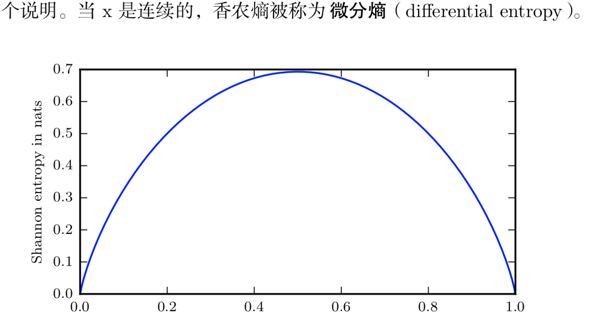
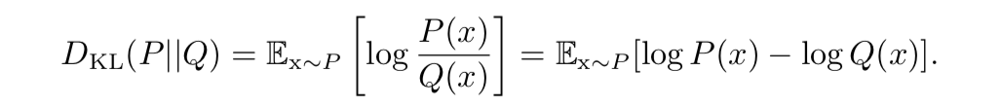
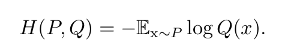

**自信息**

$$I(x) = -logP(x) $$

* 用 􏰱􏰲􏰳 log 来表示自然对数，其底数为 e
* 定义的 I(x) 单位是奈特(nats)。一奈特是以 $$\frac{1}{e}$$ 的概率观测到一个事件时获得的信息量

底数为 2 的对数，单位是比特(bit)或者香农(shannons);通过比特度 量的信息只是通过奈特度量信息的常数倍。

**自信息只处理单个的输出**

* 用香农熵 Shannon entropy 来对整个概率分布中的不确定性总量进行量化:
* $$H (x􏰀) = E􏰀_{x~P} [I (x)] = −E􏰀_{x~P} [􏰱􏰲􏰳 logP (x)]$$
* 一个分布的香农熵是指遵循这个分布的事件所产生的期望信 息总量

对于同一个随机变量 􏰀 有两个单独的概率分布 P (􏰀x) 和 Q(x􏰀)，我们可 以使用 KL 散度(Kullback-Leibler (KL) divergence)来衡量这两个分布的差异

​	在离散型变量的情况下，KL 散度衡量的是，当我们使用一种被设计成能够使 得概率分布 Q 产生的消息的长度最小的编码，发送包含由概率分布 P 产生的符号 的消息时，所需要的额外信息量 (如果我们使用底数为 2 的对数时，信息量用比特衡 量，但在机器学习中，我们通常用奈特和自然对数。)

**KL散度**：

* 是非负的
* 
* KL 散度为 0 当且仅当 P 和 Q 在离散型变量的情况下是相同的分布，或者在连续型变量的情况下是 ‘‘几乎 处处’’ 相同的
*  KL 散度是非负的并且衡量的是两个分布之间的差异，它经常 被用作分布之间的某种距离。然而，它并不是真的距离因为它不是对称的

一个和 KL 散度密切联系的量是交叉熵(cross-entropy)

* 
* 针对 Q 最小化交叉熵等价于最小化 KL 散度，因为 Q 并不参与被省略的那一项

