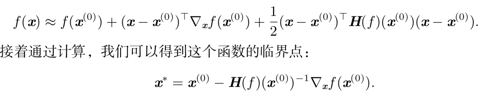

**目标函数**：要最小化或最大化的函数成为目标函数(objective function) 或 准则（criterion）

​	对其进行最小化时，我们也把它称为代价函数(cost function)、损失函数(loss function)或误差函数(error function)

* 导数对于最小化一个函数很有用，因为它告诉我们如何更改 x 来略微地改善 y

* 对于足够小的 ε 来说，f(x􏰀 − εsign(f′(x􏰀))) 是比 f(􏰀x) 小的
* 将 􏰀x往导数的反方向移动一小步来减小 f (x􏰀)。这种技术被称为 梯度下降(gradient descent)

**临界点 critical point /驻点 stationary point**：$$f^{'}(x)$$

**鞍点saddle point**：有些临界点既不是最小点也不是最大

**偏导数（partial derivative）**：是函数f在u方向的斜率

 **梯度(gradient)**是相 对一个向量求导的导数

$$x^􏰀′ = 􏰀 − ε∇􏰀_xf(􏰀x)$$  

$$\varepsilon$$ 为学习率（learning rate）,是一个确定步长大小的正标量

虽然梯度下降被限制在连续空间中的优化问题，但不断向更好的情况移动一小 步(即近似最佳的小移动)的一般概念可以推广到离散空间。递增带有离散参数 的目标函数被称为爬山(hill climbing)算法 

计算输入和输出都为向量的函数的所有偏导数。包含所有这样的 偏导数的矩阵被称为**Jacobian 矩阵**

二阶导数表示变化的快慢

一节导数表示变化的方向

当我们的函数具有多维输入时，二阶导数也有很多。我们可以将这些导数合并 成一个矩阵，称为 Hessian 矩阵。Hessian 矩阵 H􏱀(f )(x􏰀) 定义为

$$H(f)(x)_{i,j} = \frac {\delta^2}{\delta_{x_i} \delta_{x_i}} f(x)$$

Hi,j =Hj,i，因此Hessian矩阵在这些点上是对称的

当 f′(x) = 0 且 f′′(x) > 0 时，􏰀 是一个局 部极小点。同样，当 f′(x) = 0 且 f′′(x) < 0 时，􏰀 是一个局部极大点

牛顿法(Newton’s method：牛顿法基于一个二阶泰勒展开来近似 􏰀$$x^{(0)}$$ 附 近的 f (􏰀x)

仅使用梯度信息的优化算法被称为一阶优化算法 (first-order optimization al- gorithms)，如梯度下降。

使用 Hessian 矩阵的优化算法被称为二阶最优化算法 (second-order optimization algorithms)，如牛顿法

