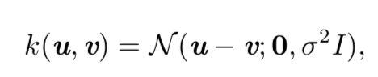

逻辑回归 logistic regression

支持向量机 support vector machine SVM

* 核技巧 kernel trick $$k(x,x^{(i)}) = \phi(x)\phi(x^{(i)})$$

核技巧十分强大有两个原因

* 它使我们能够使用保证有效收敛的凸优化 技术来学习非线性模型(关于x􏰤的函数)，因为我们可以认为φ是固 定的，仅优化 α，即优化算法可以将决策函数视为不同空间中的线性函数。
* 核 函数 k 的实现方法通常有比直接构建 φ(x􏰤) 再算点积高效很多

最常用的核函数是高斯核(Gaussian kernel)

其中 N (x; μ, Σ) 是标准正态密度。这个核也被称为 径向基函数(radial basis func- tion, RBF)核，因为其值沿 􏰵 v中从 u􏰴 向外辐射的方向减小。高斯核对应于无限维空 间中的点积，但是该空间的推导没有整数上最小核的示例那么直观

​	核机器的一个主要缺点是计算决策函数的成本关于训练样本的数目是线性的。 因为第 i 个样本贡献 $$\alpha_ik(x,x^i)$$ 到决策函数。支持向量机能够通过学习主要包含零 的向量 α，以缓和这个缺点。那么判断新样本的类别仅需要计算非零 αi 对应的训 练样本的核函数。这些训练样本被称为支持向量(support vector)

**决策树**

