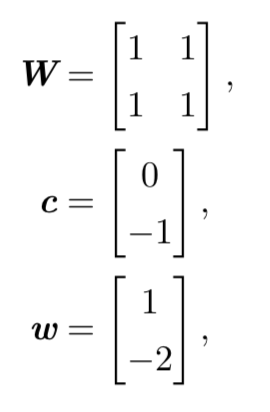
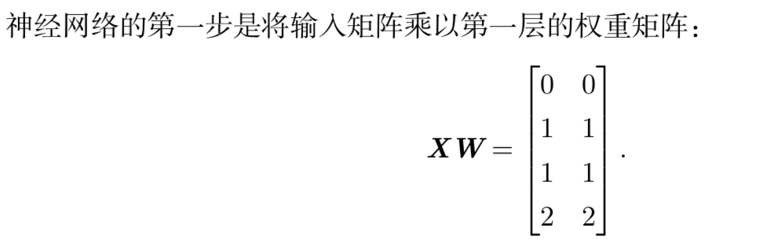
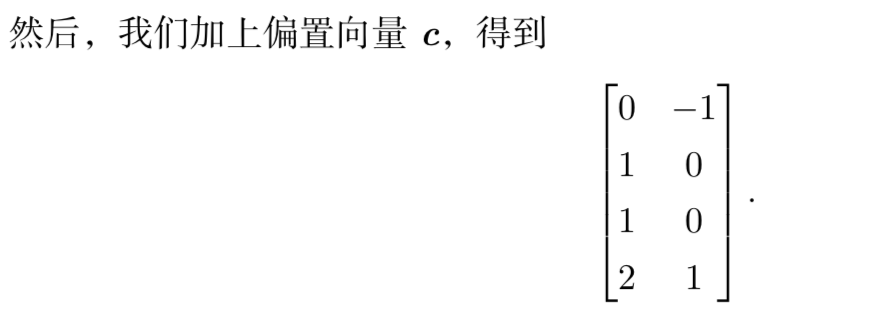

深度前馈网络 deep feedforward network 也叫前馈神经网络 feedforward neural network 或者多层感知机（multilayer perceptron ,MLP）

这种模型被称为前向(feedforward)的，是因为信息流过 􏰀 x 的函数，流经用于 定义 f 的中间计算过程，最终到达输出y 􏰁。在模型的输出和模型本身之间没有反馈 (feedback)连接。当前馈神经网络被扩展成包含反馈连接时，它们被称为 循环神经网络(recurrent neural network)

链的全长称为模型的深度(depth)

前馈网络的最后一层被称为 输出层(output layer)

除了输入和输出就是隐藏层 hidden layer

XOR函数（“异或”逻辑）

$$f (􏰀x;W 􏰧,c 􏰨, w 􏰦, b) = 􏰦w^\tau max \{0, W^\tau􏰧 +c 􏰨\}+ b.$$

