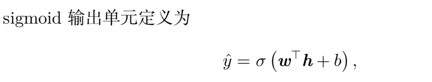
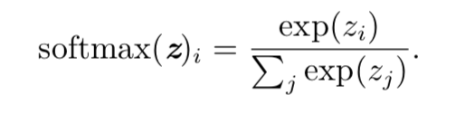
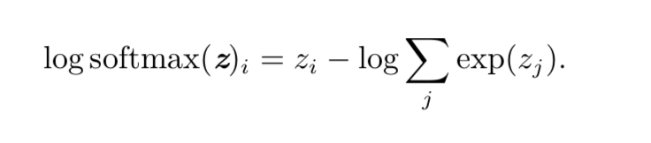

代价函数

使用最大似然学习条件分布

学习条件统计量

输出单元：

* 用于高斯输出分布的线性单元

* 用于 Bernoulli 输出分布的 sigmoid 单元

  

* 用于 Multinoulli 输出分布的 softmax 单元

  

  

负对数似然代价函数总是强烈的惩罚最活跃的的不正确预测

**神经网络必须有三个输出**

* 定义p(c = i | x) 的向量
* 对所有的i给出$$u^i(x)$$矩阵
* 对所有的i给出$$\sum(x)$$的张量

