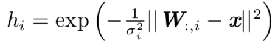

每个单元由多个过滤器驱动，maxout 单元具有一些冗余来帮助它们抵抗一 种被称为灾难遗忘(catastrophic forgetting)的现象，这个现象是说神经网络忘记 了如何执行它们过去训练的任务 

**常见的隐藏单元类型**：

* 径向基函数  radial basis function RBF

  

* softplus函数：

  $$g(a) = \zeta(a) = log(1+e^a)$$

* 硬双曲正切函数 hard tanh

