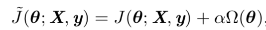
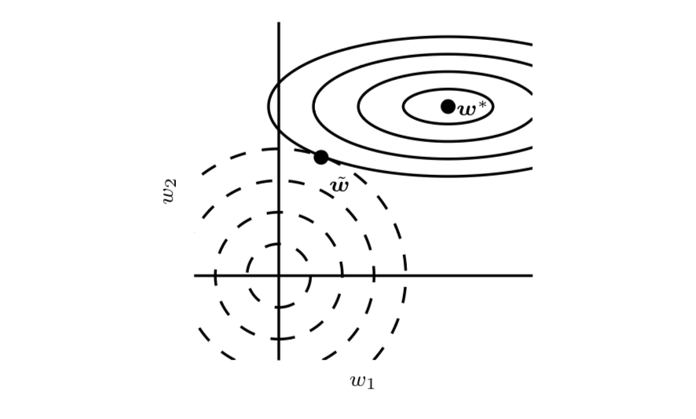
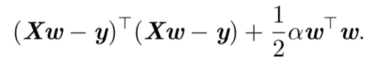
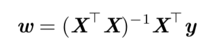
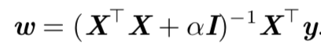
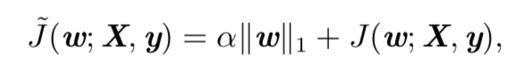
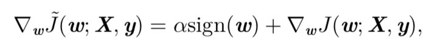

正则化后的目标函数：

其中 α ∈ [0, ∞) 是权衡范数惩罚项 Ω 和标准目标函数 J  相对贡献的超参数。将 α 设为 0 表示没有正则化。α 越大，对应正则化惩罚越大。

权重衰减(weight decay)的 L2 参数范数惩罚

L2正则又称为 岭回归或者Tiknonov正则

原目标函数：

$$(X\omega - y)^\tau(X\omega - y) + \frac{1}{2}\alpha \omega^\tau\omega$$

加入正则化之后：

原来的w解：

加入正则化之后变为：

**L1正则化**

目标函数：

对应的梯度 实际上是次梯度：

相比 L2正则化，L1正则化会产生更稀疏(sparse)的解

