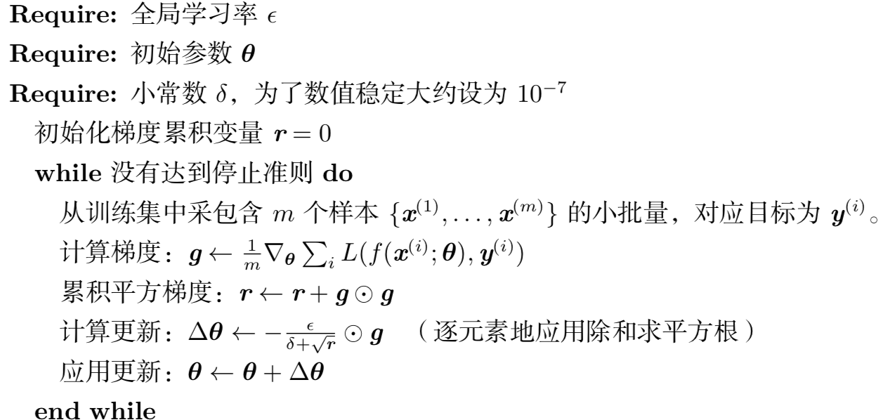

Delta-bar-delta 算法 (Jacobs, 1988) 是一个早期的在训练时适应模型参数各 自学习率的启发式方法。该方法基于一个很简单的想法，如果损失对于某个给定模 型参数的偏导保持相同的符号，那么学习率应该增加。如果对于该参数的偏导变化 了符号，那么学习率应减小。当然，这种方法只能应用于全批量优化中。

AdaGrad 算法 独立地适应所有模型参数的学习率，缩放每 个参数反比于其所有梯度历史平方值总和的平方根,而具有小偏导的参数在学习率上 有相对较小的下降

RMSProp 算法 修改 AdaGrad 以在非凸设定下效果更好，改 变梯度积累为指数加权的移动平均。AdaGrad 旨在应用于凸问题时快速收敛

Adam (Kingma and Ba, 2014) 是另一种学习率自适应的优化算法在 Adam 中， 动量直接并入了梯度一阶矩(指数加权)的估计。将动量加入 RMSProp 最直观的 方法是将动量应用于缩放后的梯度。结合缩放的动量使用没有明确的理论动机。其 次，Adam 包括偏置修正，修正从原点初始化的一阶矩(动量项)和(非中心的)二 阶矩的估计

目前，最流行并且使用很高的优化算法包括 SGD、具动量的 SGD、RMSProp、 具动量的 RMSProp、AdaDelta 和 Adam