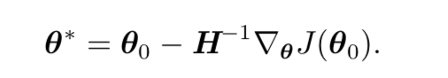

牛顿法是基于二阶泰勒级数展开在某点 θ0 附近来近似 J(θ) 的优化方法

牛顿参数更新规则：

添加正则化：

共轭梯度是一种通过迭代下降的共轭方向(conjugate directions)以有效避 免 Hessian 矩阵求逆计算的方法

对于二次曲面而言，共轭方向确保梯度沿着前一方向大小不变。因此，我们在前一 方向上仍然是极小值。其结果是，在 k-维参数空间中，共轭梯度只需要至多 k 次线 搜索就能达到极小值

Broyden-Fletcher-Goldfarb-Shanno(BFGS)算法具有牛顿法的一些优 点，但没有牛顿法的计算负担