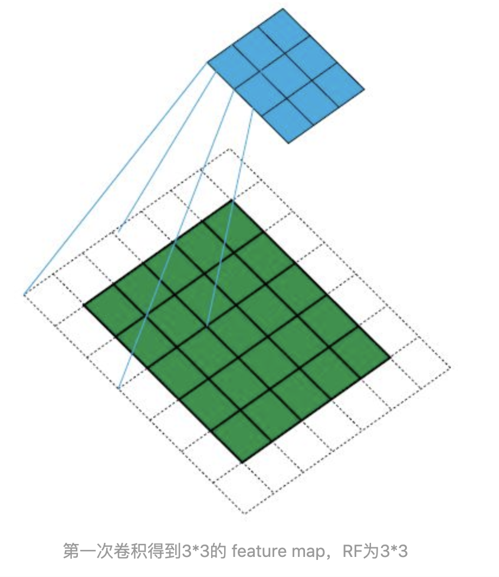
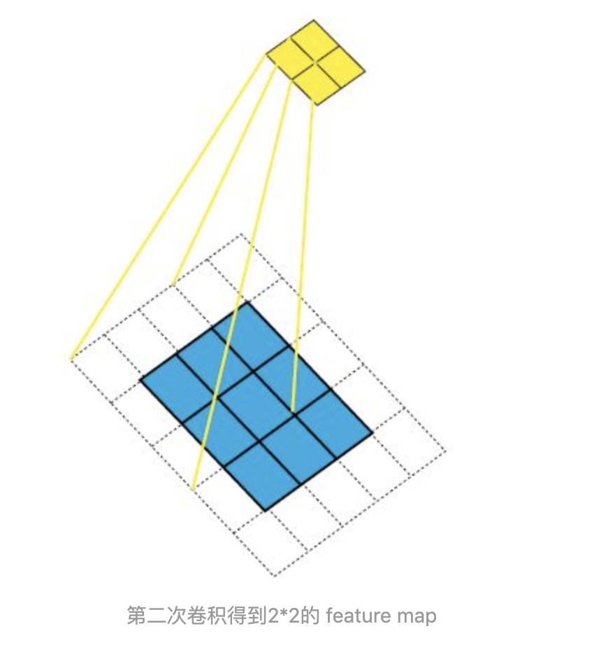
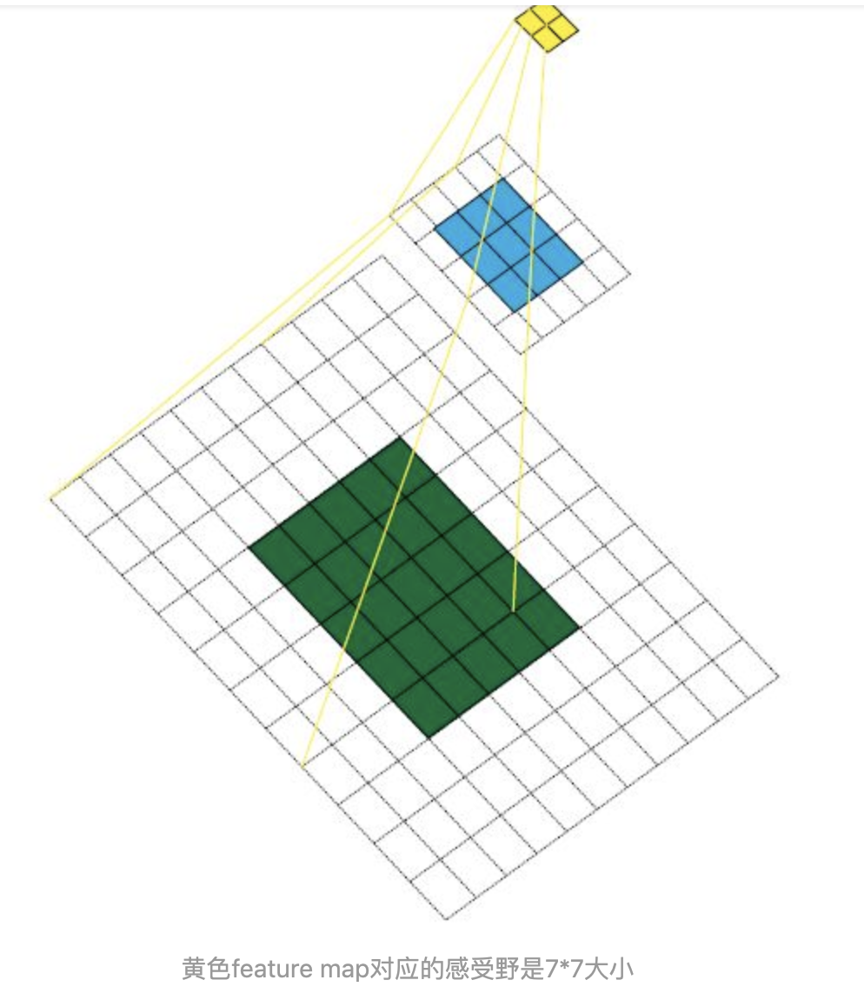

**感受野**：

在学习计算感受野之前，先可视化一下感受野吧。举一个例子，原始图像为  ，卷积核（Kernel Size）为  ，padding 为  ，stride为  ，依照此卷积规则，连续做两次卷积。熟悉卷积过程的朋友都知道第一次卷积结果是  大小的feature map，第二次卷积结果是  大小的feature map。整个过程如图所示：

1.卷积后的矩阵越变越小（如果卷积层100层，每一层都缩小最终得到的将是很小的图片）

2.输入矩阵（左）边缘像素（绿阴影）只被计算过一次，而中间像素（红阴影）被卷积计算多次，意味着丢失图像角落信息。

**为了解决这两个问题，就对输入图像进行padding，即填充像素**