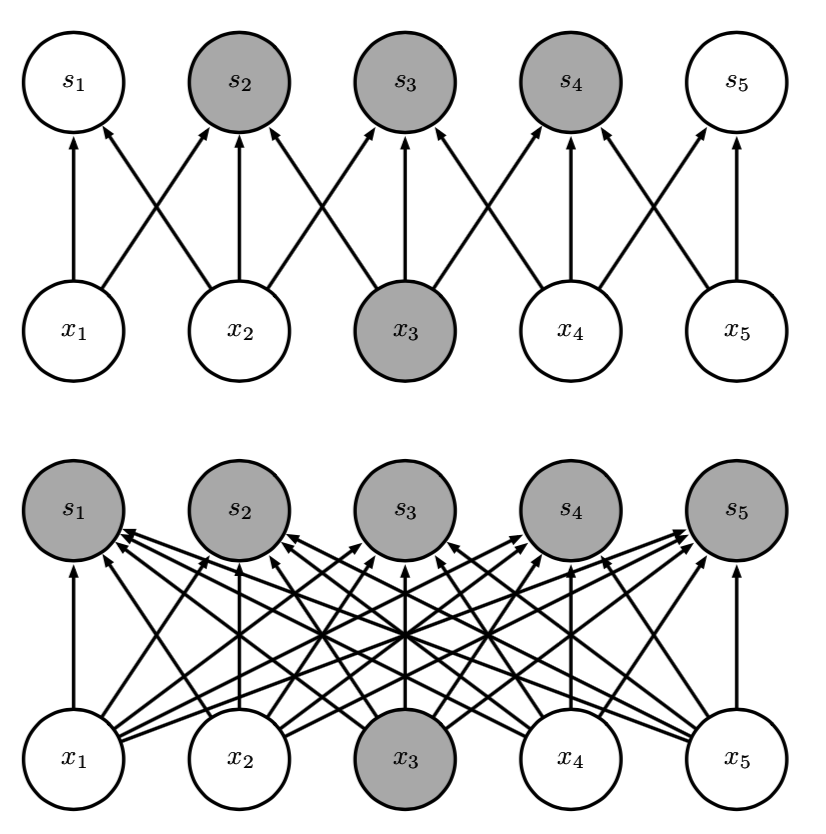
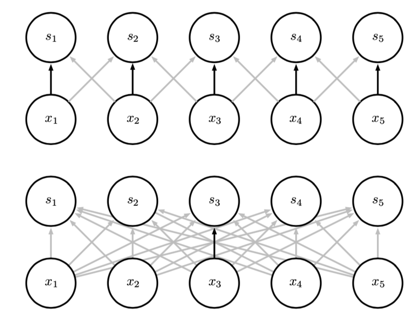

**卷积运算**：

*  稀疏交互(sparse interactions)
* 参数共享(parameter sharing)
* 等变表示(equivariant representa- tions)

卷积网络具有 稀疏交 互(sparse interactions)(也叫做稀疏连接(sparse connectivity)或者稀疏权重
(sparse weights))的特征。这是使核的大小远小于输入的大小来达到的

稀疏连接，对每幅图从下往上看。我们强调了一个输入单元 x3 以及在 􏰶 中受该单元影响 的输出单元。(上) 当 􏰶 是由核宽度为 3 的卷积产生时，只有三个输出受到 􏰀 的影响2。(下) 当 􏰶 是由矩阵乘法产生时，连接不再是稀疏的， 所有的输出都会受到 x3 的影响。

参数共享(parameter sharing)是指在一个模型的多个函数中使用相同的参数。 在传统的神经网络中，当计算一层的输出时，权重矩阵的每一个元素只使用一次，当 它乘以输入的一个元素后就再也不会用到了、在卷积神经网络中，核的每一个元素都作用在输入的每一位置上(是 否考虑边界像素取决于对边界决策的设计)。卷积运算中的参数共享保证了我们只需 要学习一个参数集合，而不是对于每一位置都需要学习一个单独的参数集合

参数共享。黑色箭头表示在两个不同的模型中使用了特殊参数的连接。(上) 黑色箭头表示 在卷积模型中对 3 元素核的中间元素的使用。因为参数共享，这个单独的参数被用于所有的输入 位置。(下) 这个单独的黑色箭头表示在全连接模型中对权重矩阵的中间元素的使用。这个模型没 有使用参数共享，所以参数只使用了一次。

