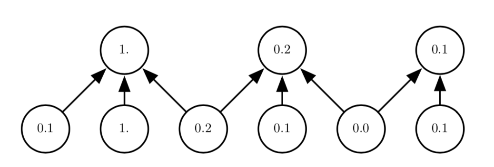

池化函数使用某一位置的相邻输出的总体统计特征来代替网络在该位置的输出。 例如，最大池化(max pooling)函数给出相邻矩形区 域内的最大值。其他常用的池化函数包括相邻矩形区域内的平均值、L2 范数以及基 于据中心像素距离的加权平均函数。

不管采用什么样的池化函数，当输入作出少量平移时，池化能够帮助输入的表 示近似 不变(invariant)。对于平移的不变性是指当我们对输入进行少量平移时，经 过池化函数后的大多数输出并不会发生改变、局部平移不变性是一个很有用的性质，尤其是当我们关心某个特征是否出现 而不关心它出现的具体位置时。例如，当判定一张图像中是否包含人脸时，我们并 不需要知道眼睛的精确像素位置，我们只需要知道有一只眼睛在脸的左边，有一只 在右边就行了。但在一些其他领域，保存特征的具体位置却很重要。例如当我们想 要寻找一个由两条边相交而成的拐角时，我们就需要很好地保存边的位置来判定它 们是否相交。

因为池化综合了全部邻居的反馈，这使得池化单元少于探测单元成为可能

池化对于处理不同大小的输入具有重要作用、例如我们想对不 同大小的图像进行分类时，分类层的输入必须是固定的大小，而这通常通过调整池 化区域的偏置大小来实现，这样分类层总是能接收到相同数量的统计特征而不管最 初的输入大小了

​	带有降采样的池化。这里我们使用最大池化，池的宽度为三并且池之间的步幅为二。这使 得表示的大小减少了一半，减轻了下一层的计算和统计负担。注意到最右边的池化区域尺寸较小， 但如果我们不想忽略一些探测单元的话就必须包含这个区域。