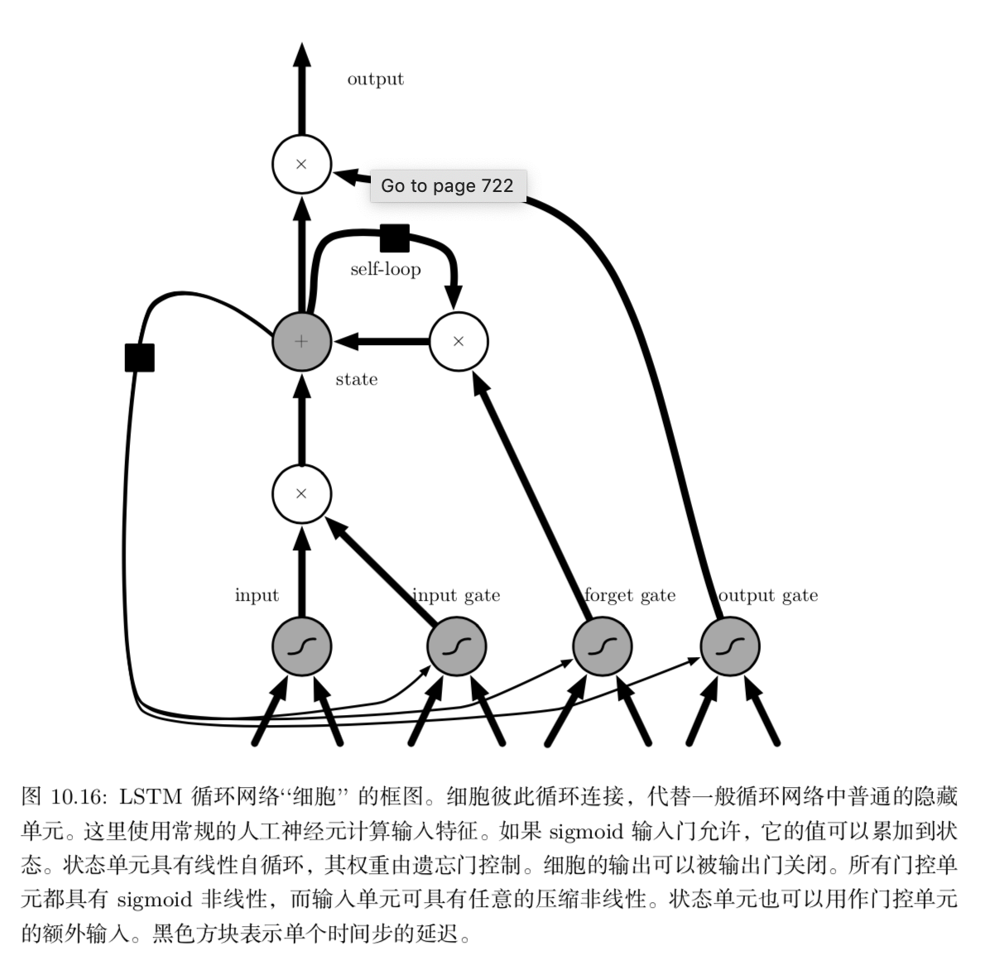

实际应用中最有效的序列模型称为门控 RNN(gated RNN)。 包括基于长短期记忆(long short-term memory)和基于门控循环单元(gated recurrent unit)的网络。

像渗漏单元一样，门控 RNN 想法也是基于生成通过时间的路径，其中导数既不 消失也不发生爆炸。渗漏单元通过手动选择常量的连接权重或参数化的连接权重来 达到这一目的。门控 RNN 将其推广为在每个时间步都可能改变的连接权重。

产生梯度长时间持续流动的路径是初始 长短期记忆 (long short-term memory, LSTM)模型的核心贡献

