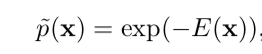
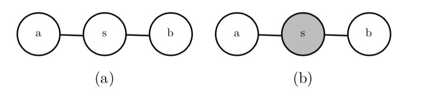

结构化概率模型使用图(在图论中 ‘‘结点’’ 是通过 ‘‘边’’ 来连接的)来表示随机 变量之间的相互作用。每一个结点代表一个随机变量。每一条边代表一个直接相互 作用。这些直接相互作用隐含着其他的间接相互作用，但是只有直接的相互作用会 被显式地建模。

图模型可以被大致分为两类:基于有向无环图的模型和基 于无向图的模型。

有向图模型(directed graphical model)是一种结构化概率模型，也被称为信 念网络(belief network)或者贝叶斯网络(Bayesian network)

**有向图所有的边都是有方向的**

有向图模型为我们提供了一种描述结构化概率模型的语言。而另一种常见的语 言则是无向模型(undirected Model)，也被称为**马尔可夫随机场(Markov random field, MRF)** 或者是**马尔可夫网络(Markov network)**

无向模型中许多有趣的理论结果都依赖于 ∀􏰈, p ̃(􏰈) > 0 这个假设。使这个条件满足的一种简单方式是使用基于能量的模型(Energy-based model, EBM)，其中

E(􏰈) 被称作是能量函数(energy function)。

服从上面形式的任意分布都是玻尔兹曼分布(Boltzmann distribution) 的一个实例。正是基于这个原因，我们把许多基于能量的模型称为玻尔兹曼机(Boltzmann Machine)

在无向模型中，识别图中的条件独立性是非常简单的。在这种情况下，图中隐 含的条件独立性称为分离(separation)

